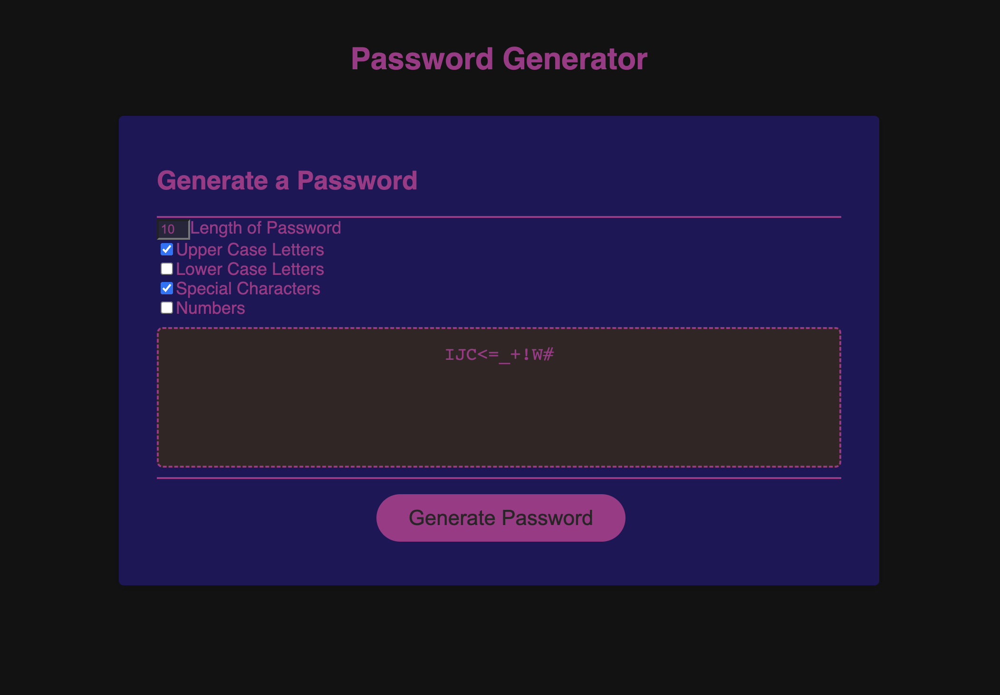

# Password_Generator
Here I make a website that uses javascript to 
[generate](https://olegreg762.github.io/Password_Generator/)
 a password. 
I use the method 
[getRandomValues](https://developer.mozilla.org/en-US/docs/Web/API/Crypto/getRandomValues) 
from the Web API 
[Crypto](https://developer.mozilla.org/en-US/docs/Web/API/Web_Crypto_API)
to generate cryptographically strong random numbers. 
Using this method is more cryptographically secure than
[Math.random](https://developer.mozilla.org/en-US/docs/Web/JavaScript/Reference/Global_Objects/Math/random)
from the 
[Math](https://developer.mozilla.org/en-US/docs/Web/JavaScript/Reference/Global_Objects/Math)
built in javascript object. 

I use a couple different input methods to allow the user to customize their passsword.
The "textbox" method is used for describing how long the user wants their password.
I do have built in error handling in case the user inputs a password length of less than 8 characters or more than 128. This also handles if the user inputs a character that is not a number.
If either of the error conditions exists after the generate password button is clicked and the message "Length of Pasword Must Be a Number Between 8 and 128!" will appear in the password box. 

Another input method I use is the "checkbox" method for the user to select which groups of characters they would like to be included in the password. The "checkbox" returns a boolean to the javascript which then inlcudes or omits each respective grouping of characters. There is a confirm prompt that appears if the user doesn't choose to include a group in the password. This will appear for each group that is omitted. The prompt will inform the user that their password will be less secure without the group(s) included and will ask they confirm their choice to exclude it. If the user doesn't include at least one group a message  will be displayed in the password box "You Must Choose At Least One of The Groups To Be Included!". 

